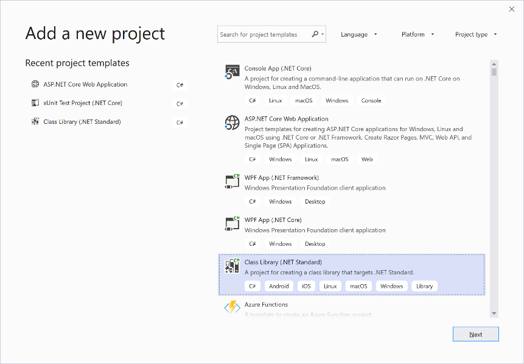
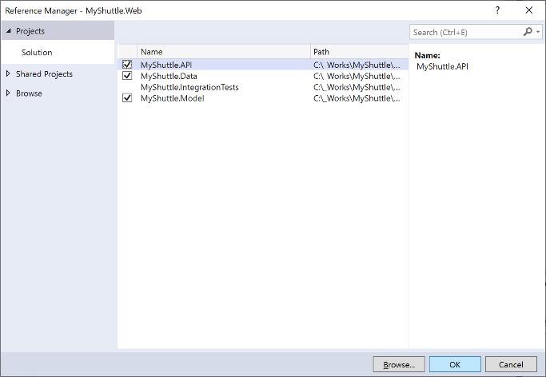
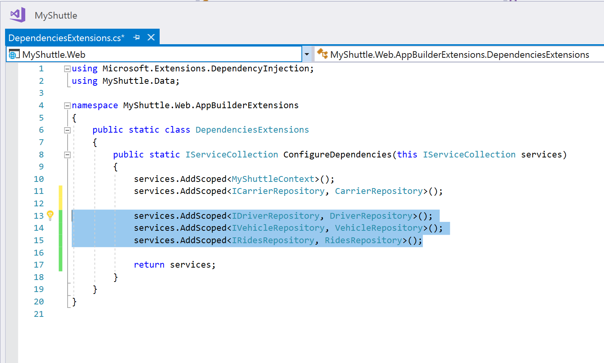
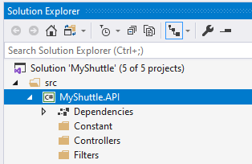
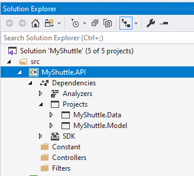
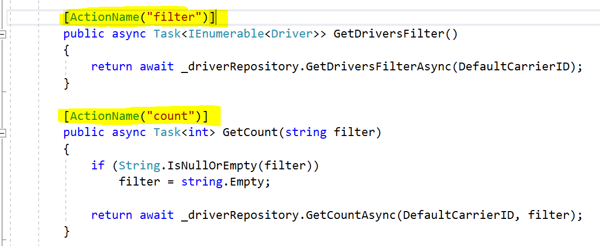
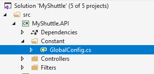

# Module 06: Web API
## .NET Core: Developing Cross-Platform Web Apps with ASP.NET Core – WorkshopPLUS

Student Lab Manual

**Conditions and Terms of Use**

**Microsoft Confidential**

This training package is proprietary and confidential, and is intended only for
uses described in the training materials. Content and software is provided to
you under a Non-Disclosure Agreement and cannot be distributed. Copying or
disclosing all or any portion of the content and/or software included in such
packages is strictly prohibited.

The contents of this package are for informational and training purposes only
and are provided "as is" without warranty of any kind, whether express or
implied, including but not limited to the implied warranties of merchantability,
fitness for a particular purpose, and non-infringement.

Training package content, including URLs and other Internet Web site references,
is subject to change without notice. Because Microsoft must respond to changing
market conditions, the content should not be interpreted to be a commitment on
the part of Microsoft, and Microsoft cannot guarantee the accuracy of any
information presented after the date of publication. Unless otherwise noted, the
companies, organizations, products, domain names, e-mail addresses, logos,
people, places, and events depicted herein are fictitious, and no association
with any real company, organization, product, domain name, e-mail address, logo,
person, place, or event is intended or should be inferred.

© 2021 Microsoft Corporation. All rights reserved.

**Copyright and Trademarks**

© 2021 Microsoft Corporation. All rights reserved.

Microsoft may have patents, patent applications, trademarks, copyrights, or
other intellectual property rights covering subject matter in this document.
Except as expressly provided in written license agreement from Microsoft, the
furnishing of this document does not give you any license to these patents,
trademarks, copyrights, or other intellectual property.

Complying with all applicable copyright laws is the responsibility of the user.
Without limiting the rights under copyright, no part of this document may be
reproduced, stored in or introduced into a retrieval system, or transmitted in
any form or by any means (electronic, mechanical, photocopying, recording, or
otherwise), or for any purpose, without the express written permission of
Microsoft Corporation.

For more information, see Use of Microsoft Copyrighted Content at  
<http://www.microsoft.com/about/legal/permissions/>

Internet Explorer, Microsoft, Visual Studio, and Windows are either registered
trademarks or trademarks of Microsoft Corporation in the United States and/or
other countries. Other Microsoft products mentioned herein may be either
registered trademarks or trademarks of Microsoft Corporation in the United
States and/or other countries. All other trademarks are property of their
respective owners.

###Lab: Implementing Web API 


#### Objectives

After completing this lab, you will be able to:

-   Understand the basic principles of MVC.

-   Learn how to implement a view in Razor view engines.

-   Learn how to pass data from controllers to views.

-   Learn how to implement GET, POST scenarios.

#### Scenario

In this scenario, we will explore Web API Controllers.

#### System Requirements

To complete this lab, you need:

-   Microsoft Visual Studio 2019 or higher

-   Microsoft SQL Server (any edition)

#### Estimated Time to Complete This Lab 

40-60 minutes

Exercise 1: Setup the Web API Project
-------------------------------------

#### Objectives

In this exercise, you will:

-   Create a new ASP.NET Web API project in Visual Studio 2019.
-   Setup the structure for the API project and setup the correct references
    between projects in the solution.

#### Scenario

Creating a new API class library and setting up the references.

#### Task 1: Create the New Project 

1. Open Visual Studio 2019.

1. Open the solution located in `Labs/Module 06 – WebApi/Begin/MyShuttle`. You should see three projects listed under the **src** folder in the solution: **MyShuttle.Data**, **MyShuttle.Model** and **MyShuttle.Web**.

1. Add a new .NET Standard project to the **src** folder:
    - Right-click **src** folder > **Add** \> **New Project.** 
    - Select **Class Library (.NET Standard)**

        

1. Name the project **MyShuttle.API** and click **Create**.

1. Open the **MyShuttle.API.csproj** file (by double-clicking on the MyShuttle.API project) and ensure that it’s targeting .NET Standard 2.1

    

1. Delete **Class1.cs**.

1. This project will need to be referenced by **MyShuttle.Web**, which is the hosted project. So let's add a reference to MyShuttle.API from MyShuttle.Web.

    - Right-click **MyShuttle.Web** project in the Solution Explorer
    - Click **Add** \> **Reference**.
    - Select **MyShuttle.API** from the check box, and then click **OK.**

        

1. Up until now, the Web project has only needed to access the CarrierRepository, but our API will need to access the repositories for Drivers, Vehicles and Rides. 
    - Open the **MyShuttle.Web / AppBuilderExtensions / DependenciesExtensions.cs** file:
    - Add code below to the **ConfigureDependencies()** method:

    ```csharp
            services.AddScoped<IDriverRepository, DriverRepository>();
            services.AddScoped<IVehicleRepository, VehicleRepository>(); 
            services.AddScoped<IRidesRepository, RidesRepository>();
    ```

    

1. We need to create the structure for the API source files. Add *three* folders to the **MyShuttle.API** project and name them:
    - Controllers
    - Constant
    - Filters

    

    Controllers - will contain the the API Controllers themselves  
    Constant - for configuration files  
    Filters - where we will store all our Http Filter classes


Exercise 2: Implement the First API Controller
----------------------------------------------

#### Objectives

In this exercise, you will:

-   Create API Controllers.
-   Implement a CRUD (Create, Read, Update, and Delete) API using HttpPost,
    HttpPut, HttpDelete and HttpGet actions.

#### Scenario
Our API will support two resources: Analytics and Drivers. Analytics is a simple read-only API that returns dashboard level details about the data within our repositories. Drivers is a CRUD controller that will allow an external caller to read and write Driver data in the system.

#### Task 1: Implement DriversController

In a similar way to the UI part of the application, Controllers are used to
handle requests coming in to the application.

Each controller represents a grouping of API functions that can be called via
the routing framework. Usually a controller gives access to data and
functionality scoped to a single type of resource. In our project we will create
a controller to access the Drivers in the system, and another for accessing
Analytics data, to provide a feed to the dashboard.

1. In ASP.NET Core MVC, there is no difference between a controller for the UI and
a controller for an API, so we can use the same template for both. We will now add two new controllers to the class library.

    - Right-click **Controllers** folder, and click **Add** \> **New Item.**

    - Select the **Class** template.

    - Name the class **DriversController.cs**, and click **Add**.

    

1. **DriversController** should derive from **Controller** base class, and be public.

    ```csharp
        public class DriversController : ControllerBase 
        { 
    
        }
    ```

1. Add **Microsoft.AspNetCore.Mvc** (version 2.2.0) NuGet package to MyShuttle.API project.

1. Add the following *using* statements to your **DriversController.cs** source file:
    
    ```csharp
        using System.Collections.Generic;
        using System.Threading.Tasks;
        using Microsoft.AspNetCore.Mvc;
        using MyShuttle.Data;
        using MyShuttle.Model;
    ```
    
1. Add **References** to the *MyShuttle.Data* and *MyShuttle.Model* project.

    The API project itself will reference our Data and Model projects, so add these as references to the MyShuttle.API project in the same way:

    - Right-click **MyShuttle.API** and click **Add** \> **Reference.**
    - Select **MyShuttle.Data** and **MyShuttle.Model**, and then click **OK.**

    

1. In the **DriversController.cs**, implement the following constructor - which will use dependency injection.

    ```csharp
        IDriverRepository _driverRepository;
        private const int DefaultCarrierID = 0;
    
        public DriversController(IDriverRepository driverRepository)
        {
            _driverRepository = driverRepository;
        }
    ```
    

1. The implementation of the CRUD operations thereafter is straightforward, with the note that these calls have been implemented using Async to ensure performance is optimal.
      
    Place the following code after the constructor we just created in the **DriversController.cs** file

    ```csharp
        public async Task<Driver> Get(int id)
        {
            return await _driverRepository.GetAsync(DefaultCarrierID, id);
        }
    
        public async Task<IEnumerable<Driver>> Get(string filter, int pageSize, int pageCount)
        {
            if (string.IsNullOrEmpty(filter))
            filter = string.Empty;
            return await _driverRepository.GetDriversAsync(DefaultCarrierID, filter, pageSize, pageCount);
        }
    
        public async Task<IEnumerable<Driver>> GetDriversFilter()
        {
            return await _driverRepository.GetDriversFilterAsync(DefaultCarrierID);
        }
    
        public async Task<int> GetCount(string filter)
        {
            if (string.IsNullOrEmpty(filter))
            filter = string.Empty;
            return await _driverRepository.GetCountAsync(DefaultCarrierID, filter);
        }
    
        [HttpPost]
        public async Task<int> Post([FromBody]Driver driver)
        {
            driver.CarrierId = DefaultCarrierID;
            return await _driverRepository.AddAsync(driver);
        }
    
        [HttpPut]
        public async Task Put([FromBody]Driver driver)
        {
            driver.CarrierId = DefaultCarrierID;
            await _driverRepository.UpdateAsync(driver);
        }
    
        [HttpDelete]
        public async Task Delete(int id)
        {
            await _driverRepository.DeleteAsync(id);
        }
    ```


#### Task 2: Add Custom Action Routing

The current state of the code should compile and run. There are a couple of
things that need attention though. If you run the app, you can now navigate to
the new API URLs, for example try: [http://localhost:[YOUR LOCALHOST
PORT]/drivers/GetCount](http://localhost:5000/drivers/GetCount), you should see
a page with nothing but the number of drivers displayed – which is 0.

The URL is based on the server address and port, the controller name, the
action, which in this case is the method name GetCount, and the parameter list
(string filter).

The action name can be overridden simply by using the ActionName attribute. The
MVC routing engine will use the overridden action name if there is one, when
parsing the URL to determine which method to call, rather than the method name.

1. For the methods which do something other than the standard Get, Insert, Update, Delete operations, add an ActionName attribute to override the default Action.

    To the **DriversController.cs / Get(string filter, int pageSize, int pageCount)** method,  add the route name `"search"` via the ActionName attribute
    
    ```csharp
        [ActionName("search")]
    ```
    Your code should look like this:
        
    
    >    Note: you can use the drop-down in the upper-right hand corner of your code file window to get to the method quicker.
    
    
    
1. We’ll do the same thing again with two more methods. Add the *ActionName* attribute with a value of "**filter**" to **GetDriversFilter()** and "**count**" to **GetCount(string filter).**

    It should look like this:

    


1. Now run the app again, and attempt to navigate to the following paths:
    - http://localhost:[YOUR LOCALHOST PORT]/drivers/GetCount - you should get an HTTP 404 (Not Found) error. 
    - http://localhost:[YOUR LOCALHOST PORT]/drivers/count - your action will be executed successfully.


    

#### Task 3: Disable HttpCaching on all API Calls 

Many browsers will use client-side caching to improve performance and reduce the
number of network calls that need to be made. This behavior is enabled by
default in many browsers, so to disable it, we will use a filter on our
controller to add a header to the response that our APIs will return.

1. Add the **NoCacheFilterAttribute.cs** file from the assets folder to your project's **Filters** folder.

    - Right-click **Filters** > **Add** \> **Existing Item**…
    - Browse to the **Filters** folder in assets folder `C:/.../Assets/MyShuttle.API/Filters`
    - Select **NoCacheFilterAttribute.cs** and click Add.

    

1. Open the **NoCacheFilterAttribute.cs** file. Look at the Filter's code to understand how it works – its straightforward:

    - The class overrides "OnActionExecuted" of the base class (ActionFilterAttribute) – checks to see if the HttpStatus is OK (200), and no cacheControl header has been set already.  
    - It then adds two headers (Pragma and CacheControl) to disable the cache, and sets the Expires header value to yesterday. These tactics will disable caching for the majority of scenarios.

1. Add the NoCacheFilterAttribute to the DriversController class

    ```csharp
        [NoCacheFilter]
    ```
    
    It should look like the code below: 
    
    
    
    
1. Build your app to confirm it all still compiles correctly.


Exercise 3: Implement the Analytics API Controller
--------------------------------------------------

#### Objectives

In this exercise, you will complete the API by adding the final controller and its helper class.

#### Scenario

The AnalyticsController is reasonably simple – it uses the existing repository interfaces to query summary information and return structured data as the result.

#### Task 1: Implement Analytics controller

1. Add the existing **GlobalConfig.cs** file from the assets folder:

    - Right-click the **Constant** folder, and click **Add** \> **Existing Item…**

    - Browse to the folder `C:\...\Assets\MyShuttle.API\Constant`, select **GlobalConfig.cs** and click **Add**.
    
    

    The **GlobalConfig** is a simple helper class used by the **AnalyticsController** to provide a central place for configuration – in this case we are providing the default number of items to return when requesting the "Top" drivers or vehicles.


1. Add the Analytics Controller class to the project

    - Right-click the **Controllers** folder, and click **Add** \> **Existing Item…**
    - Browse to the folder `C:\...\Assets\MyShuttle.API\Controllers`
    - Select **AnalyticsController.cs** and click **Add**.

    

1. Examine the **AnalyticsController** class – it should all make sense based on the **DriverController** code completed already. Note again the use of async for performance best practice.

    - The constructor uses dependency injection to receive the repositories.
    - The action names are overridden to provide an easier to consume URL for consumers.
    - The controller builds models from the result of the repository calls, and returns them as structured data.
    - Note there is no need to convert the data models to XML or JSON, the framework handles this on your behalf.

1. Build and run the app now that it is complete.

1. Navigate to `http://localhost:[YOUR LOCALHOST PORT]/analytics/summary` to see a JSON formatted output from your GetSummaryInfo() call. Note the structure matches the SummaryAnalyticInfo model in the MyShuttle.Models project.

    

1. The final project should look like the following screenshot:

    


